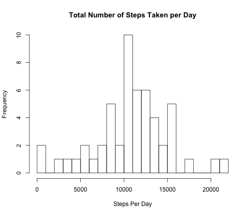
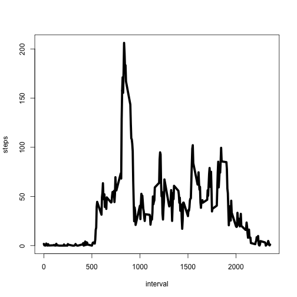
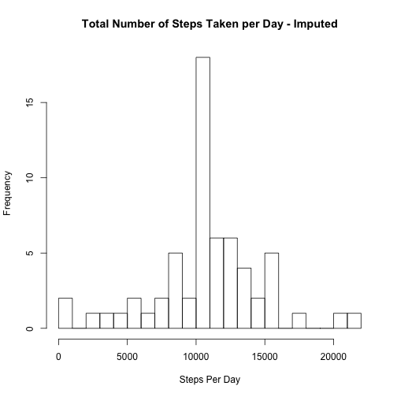
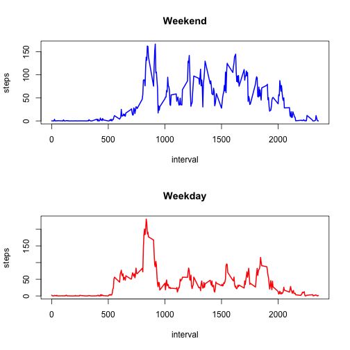

Peer Assessment 1
========================================================

It is now possible to collect a large amount of data about personal movement using activity monitoring devices such as a Fitbit, Nike Fuelband, or Jawbone Up. These type of devices are part of the "quantified self" movement -- a group of enthusiasts who take measurements about themselves regularly to improve their health, to find patterns in their behavior, or because they are tech geeks. But these data remain under-utilized both because the raw data are hard to obtain and there is a lack of statistical methods and software for processing and interpreting the data.

Loading the activity data file and taking a look at what it contains:


```r

temp <- tempfile()
download.file("https://d396qusza40orc.cloudfront.net/repdata%2Fdata%2Factivity.zip", 
    method = "curl", temp)
activity <- read.table(unz(temp, "activity.csv"), sep = ",", header = T)
```


```r
names(activity)
```

```
## [1] "steps"    "date"     "interval"
```

```r
str(activity)
```

```
## 'data.frame':	17568 obs. of  3 variables:
##  $ steps   : int  NA NA NA NA NA NA NA NA NA NA ...
##  $ date    : Factor w/ 61 levels "2012-10-01","2012-10-02",..: 1 1 1 1 1 1 1 1 1 1 ...
##  $ interval: int  0 5 10 15 20 25 30 35 40 45 ...
```


**What is mean total number of steps taken per day?**

Total mean and median (summary) of number of steps taken per day:

```r
summary(aggregate(steps ~ date, data = activity, FUN = sum, na.rm = T)$steps)
```

```
##    Min. 1st Qu.  Median    Mean 3rd Qu.    Max. 
##      41    8840   10800   10800   13300   21200
```

Mean and Median seperately:

```r
mean(aggregate(steps ~ date, data = activity, FUN = sum, na.rm = T)$steps)
```

```
## [1] 10766
```

```r
median(aggregate(steps ~ date, data = activity, FUN = sum, na.rm = T)$steps)
```

```
## [1] 10765
```


Histogram of the total number of steps taken each day:

```r
hist(aggregate(steps ~ date, data = activity, FUN = sum, na.rm = T)$steps, xlab = "Steps Per Day", 
    main = "Total Number of Steps Taken per Day", breaks = 20)
```

 


**What is the average daily activity pattern?**

Time series plot of the 5-minute interval and the average number of steps taken, averaged across all days:

```r
mean_steps <- aggregate(steps ~ interval, data = activity, FUN = mean, na.rm = TRUE)
plot(mean_steps, type = "l", lwd = 5)
```

 


**Which 5-minute interval, on average across all the days in the dataset, contains the maximum number of steps?**

```r
maxNumberSteps <- mean_steps[mean_steps$steps == max(mean_steps$steps), ]
print(paste("The maximum number of steps is", round(maxNumberSteps$steps[[1]]), 
    "at interval", maxNumberSteps$interval[[1]]))
```

```
## [1] "The maximum number of steps is 206 at interval 835"
```


**Imputing missing values**

Total number of missing values in the dataset:

```r
print(paste(sum(is.na(activity)), "rows with NAs found"))
```

```
## [1] "2304 rows with NAs found"
```


**Devise a strategy for filling in all of the missing values in the dataset. The strategy does 
not need to be sophisticated. For example, you could use the mean/median for that day, 
or the mean for that 5-minute interval, etc.**

Taking the mean of each interval for imputation:

```r
meanPerInterval <- aggregate(steps ~ interval, data = activity, FUN = mean, 
    na.rm = T)
activityImputed <- activity
activityImputed$steps <- ifelse(is.na(activityImputed$steps), meanPerInterval$steps[match(activityImputed$interval, 
    meanPerInterval$interval)], activityImputed$steps)
```


** Make a histogram of the total number of steps taken each day and Calculate and report the mean and median total number of steps taken per day.**

```r
hist(aggregate(steps ~ date, data = activityImputed, FUN = sum, na.rm = T)$steps, 
    xlab = "Steps Per Day", main = "Total Number of Steps Taken per Day - Imputed", 
    breaks = 20)
```

 


** Do these values differ from the estimates from the first part of the assignment? **

Summary of activity data set:

```r
summary(activityImputed$steps)
```

```
##    Min. 1st Qu.  Median    Mean 3rd Qu.    Max. 
##     0.0     0.0     0.0    37.4    27.0   806.0
```


Summary of imputed activity data set:

```r
summary(activity$steps)
```

```
##    Min. 1st Qu.  Median    Mean 3rd Qu.    Max.    NA's 
##     0.0     0.0     0.0    37.4    12.0   806.0    2304
```


By imputing the data set, the median has shifted upwards from 1065 to 1066 while the mean remained unchanged:

```r
mean(aggregate(steps ~ date, data = activity, FUN = sum, na.rm = T)$steps)
```

```
## [1] 10766
```

```r
median(aggregate(steps ~ date, data = activity, FUN = sum, na.rm = T)$steps)
```

```
## [1] 10765
```

```r
mean(aggregate(steps ~ date, data = activityImputed, FUN = sum, na.rm = T)$steps)
```

```
## [1] 10766
```

```r
median(aggregate(steps ~ date, data = activityImputed, FUN = sum, na.rm = T)$steps)
```

```
## [1] 10766
```

 
**Are there differences in activity patterns between weekdays and weekends?**

Adding the variable 'weektype' to the imputed data set:

```r
activityImputed$weektype <- as.factor(ifelse(weekdays(as.Date(activityImputed$date, 
    "%Y-%m-%d")) %in% c("Sunday", "Saturday"), "weekend", "weekday"))
```


Panel plot containing a time series plot of the 5-minute interval and the average number of steps taken, 
averaged across all weekday days or weekend days:

```r
par(mfrow = c(2, 1))
plot(aggregate(steps ~ interval, data = activityImputed[(activityImputed$weektype == 
    "weekend"), ], FUN = mean), type = "l", main = "Weekend", lwd = 2, col = "blue")
plot(aggregate(steps ~ interval, data = activityImputed[(activityImputed$weektype == 
    "weekday"), ], FUN = mean), type = "l", main = "Weekday", lwd = 2, col = "red")
```

 


